# inflation_py 
An implementation of inflation from silhouettes in python.
Generate a height/depth map and a mesh from a single silhouette.
No machine learning is included.

# Sample inputs and outputs
|Inputs|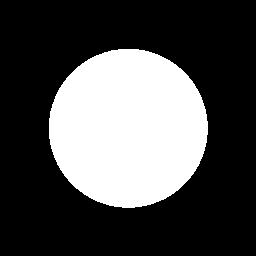|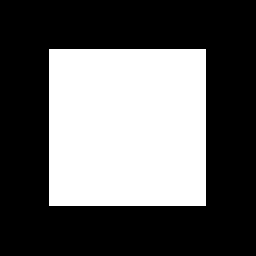||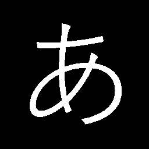|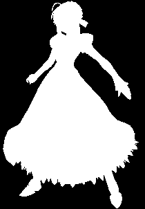|
|---|:---:|:---:|:---:|:---:|:---:|
|Distance Transform|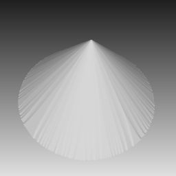|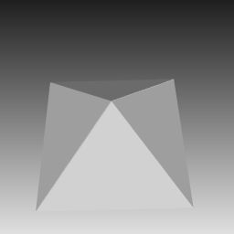||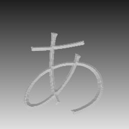|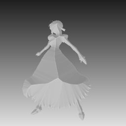|
|Distance Transform + Activation (tanh)|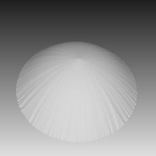|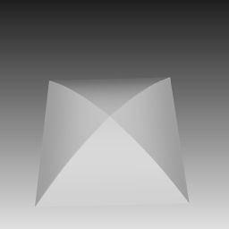|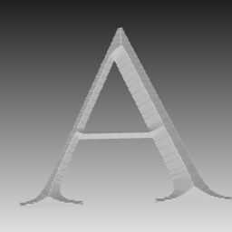||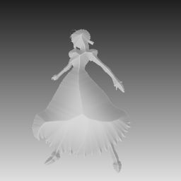|
|Baran's method|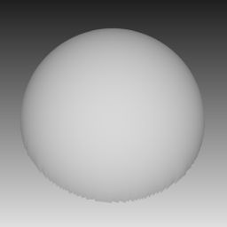|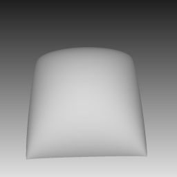|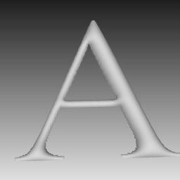|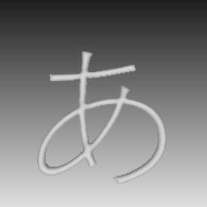|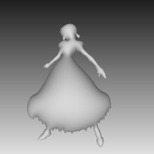|

# Algorithm
## Distance Transform (+ Activation)
Based on distance transform that computes distance from silhouette edges to pixels in the silhouette.
This method tends to cause steepy surfaces.
Additioanlly, you can set activation function to operate steepness but it is difficult to control.

## Baran's method
Based on Poisson's equation.
Implementation of the following paper:
"Notes on Inflating Curves" [Baran and Lehtinen 2009](http://alecjacobson.com/weblog/media/notes-on-inflating-curves-2009-baran.pdf).
This method generates smooth surfaces considering gradient space.
Especially, a circle silhouette becomes a hemisphere mesh.